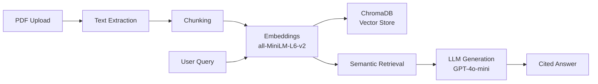

# 📄 Smart Doc QA
**[Live Demo](https://smart-doc-app-mp4nvpcbewlyldujv8zp26.streamlit.app/)**
A production-grade RAG (Retrieval-Augmented Generation) system that lets you upload PDFs and ask natural language questions with source-cited answers.

## Architecture


## Features

- **PDF Ingestion** — Extract and chunk documents with configurable strategies
- **Semantic Search** — Cosine similarity retrieval via sentence-transformers embeddings
- **Cited Answers** — Every answer includes source document, page number, and relevance score
- **REST API** — FastAPI backend with `/upload`, `/ask`, and `/health` endpoints
- **Web UI** — Streamlit frontend for document upload and interactive Q&A
- **Dockerized** — One-command startup with `docker compose up`
- **CI/CD** — GitHub Actions runs tests on every push
- **Evaluated** — Retrieval quality measured with Precision@k, Recall@k, and MRR

## Retrieval Metrics

| Metric | Score |
|--------|-------|
| Precision@1 | 0.800 |
| Precision@3 | 0.600 |
| Recall@3 | 1.000 |
| MRR | 0.900 |

## Quick Start
```bash
# Clone
git clone https://github.com/Thejas2003gowda/smart-doc-qa.git
cd smart-doc-qa

# Option 1: Docker (recommended)
docker compose up --build
# API: http://localhost:8000/docs | UI: http://localhost:8501

# Option 2: Local
python -m venv venv && source venv/bin/activate
pip install -r requirements.txt
uvicorn src.api.main:app --port 8000    # Terminal 1
streamlit run app/streamlit_app.py       # Terminal 2
```

## API Usage
```bash
# Upload a PDF
curl -X POST http://localhost:8000/upload -F "file=@document.pdf"

# Ask a question
curl -X POST http://localhost:8000/ask \
  -H "Content-Type: application/json" \
  -d '{"question": "What are the key findings?", "top_k": 3}'
```

## Project Structure
```
smart-doc-qa/
├── src/
│   ├── ingestion/      # PDF loading and chunking
│   ├── embeddings/     # Sentence-transformer embeddings
│   ├── vectorstore/    # ChromaDB storage and retrieval
│   ├── retrieval/      # Filtered semantic search
│   ├── generation/     # LLM answer generation with citations
│   └── api/            # FastAPI REST endpoints
├── app/                # Streamlit frontend
├── evaluation/         # Retrieval quality metrics
├── tests/              # Unit and integration tests
├── Dockerfile
├── docker-compose.yml
└── .github/workflows/  # CI/CD pipeline
```

## Tech Stack

Python 3.11 · FastAPI · Streamlit · ChromaDB · Sentence-Transformers · OpenAI · Docker · GitHub Actions · pytest

## Running Tests
```bash
python -m pytest tests/ -v
```

## License

MIT